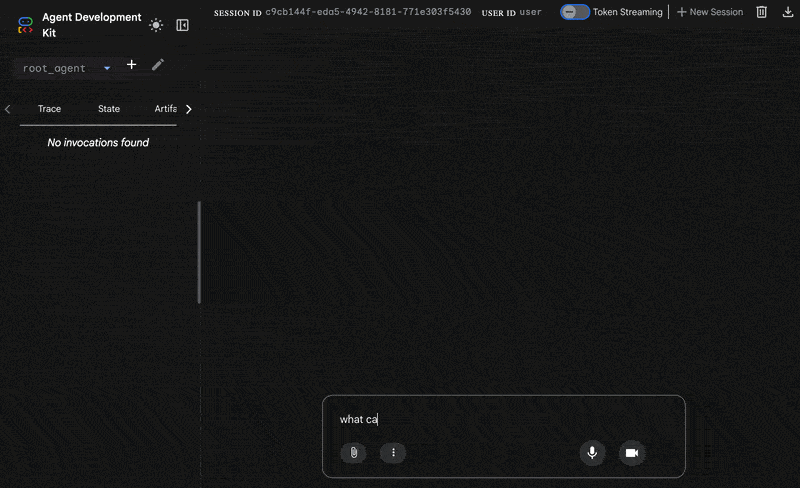
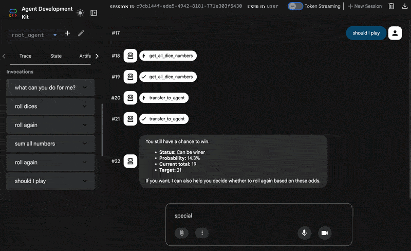
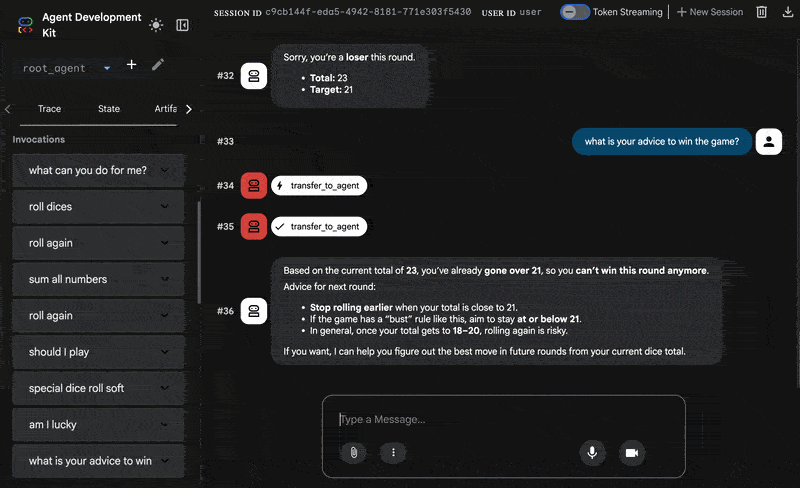

# A2A rolling-dice Agents

This application use **Agent-to-Agent (A2A)** architecture in the Agent Development Kit (ADK), showcasing how multiple agents can work together to handle complex tasks. 
The root agent can roll two dice and remote agent check if user after some trials got 21 and win or loose a game.

## Overview

The A2A Basic sample consists of:

- **Root Agent** (`root_agent`): The main orchestrator that delegates tasks to specialized sub-agents
- **Roll Agent** (`roll_dice_agent`): A local sub-agent that handles dice rolling operations
- **Luck Test Agent** (`check_winning_agent`): A remote A2A agent that checks if sum of dices are below or equal 21

## Architecture

```
┌─────────────────┐    ┌────────────────────┐    ┌────────────────────┐
│   Root Agent    │───▶│   sepcial dice     │───▶│   Remote Winning   │   
│    (Local)      │    │     sub Agent      │    │     Agent          │
│                 │    │      (local)       │    │  (localhost:8001)  │
│                 │◀───│                    │◀───│                    │
└─────────────────┘    └────────────────────┘    └────────────────────┘
```
##  Example session
This picture present the three agents with play certain role at Rolling Dice example.
The Root Agent is presented on the left, special dice sub Agent in the middle and Remote Winning Agent on the right.


- Section 1

- Section 2

- Section 3

## Key Features - Chat example
#### German:
- Wobei kannst du mir helfen?
- "Würfeln" oder "Nochmal würfeln"
- Überprüfe dein Glück
- Spezialwurf
- Bin ich glücklich
- Starte das Spiel

#### English:
- How can you help me?
- roll dices
- special dices roll
- check my luck
- should I play
- start the game

### 1. **Local Sub-Agent Integration**
- The `special_dice_agent` demonstrates how to create and integrate with local sub-agents
- The `root_agent` handles dice rolling and storing dice number in the state
- Uses a simple function tool (`roll_two_dices_and_store`) for random number generation
- Uses sub-agent `special_dice_agent` to roll more often 4, 5 and 6 

### 2. **Remote A2A Agent Integration**
- The `check_winnig_agent` shows how to connect to remote agent services
- Communicates with a separate service via HTTP at `http://localhost:8001/a2a/check_winning_agent`
- Demonstrates cross-service agent communication
- At **remote_agent** folder there is instruction how to deploy agent into virtual machine

### 3. **Agent Orchestration**
- The root agent intelligently delegates tasks based on user requests
- Can chain operations (e.g., "roll a die and check if user is winner")
- Provides clear workflow coordination between multiple agents


## Setup and Usage

### Prerequisites
```bash
python -m venv .venv
source .venv/bin/activate
pip install -r requirements.txt
cp dot_env main_agent/.env
cp dot_env remote_agent/.env
# configure LLM key
```

### Running individual services
1. **Start the Remote Prime Agent server**:
   ```bash
   adk api_server --a2a --port 8001 remote_agent --log_level INFO
   ```

2. **Run the Main Agent**:
   ```bash
   # In a separate terminal, run the adk web server
   adk web main_agent --port 8002
   ```
### Running with scripts
```bash
./run.sh
# stop services
./kill_services.sh
```

### Example Interactions
```bash
curl -sS http://localhost:8002/list-apps | cat

curl -sS http://localhost:8001/a2a/check_winning_agent/.well-known/agent-card.json | python -m json.tool
```
